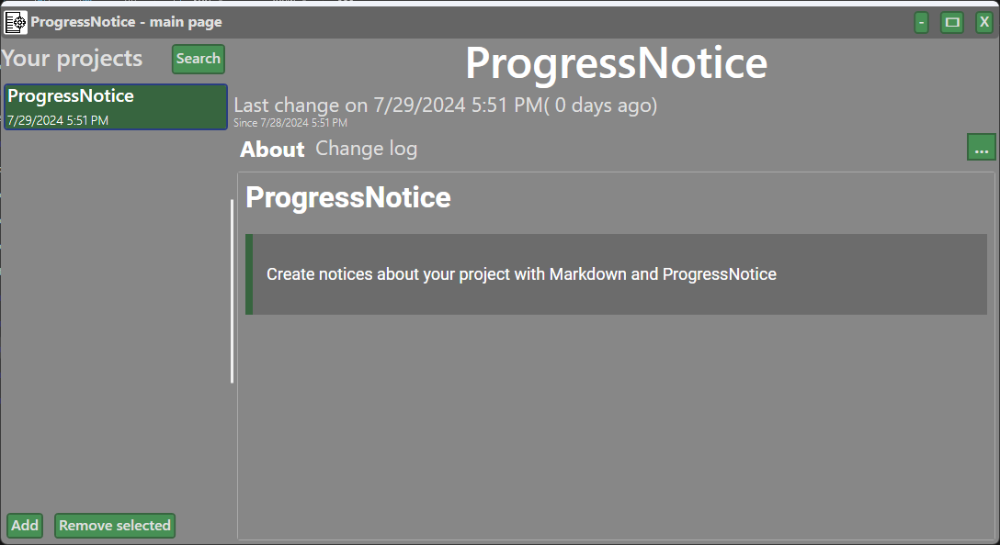
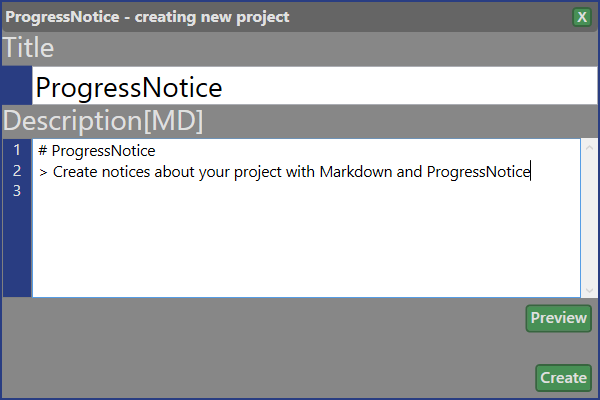
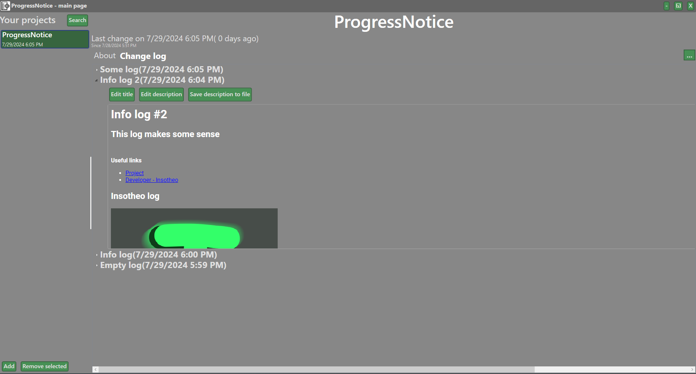

# ProgressNotice

**ProgressNotice** is a WPF application developed in C# aimed at facilitating efficient project management through clear and organized progress notices. Ideal for teams and solo developers, it allows users to document project milestones, updates, and feedback using a markdown editor.(Windows only)

## Features

- **Markdown Support**: Create formatted notices using Markdown syntax for headings, lists, code snippets, and more.
- **Multiple Projects**: Easily manage and switch between different projects.
- **Projects Organization**: Sort and categorize projects by date, name, or last change, or stars.
- **Export Capabilities**: Export notices as html or markdown files for easy sharing.

## Installation

To get started with ProgressNotice, follow these steps:

1. Clone the repository:
   ```
   git clone https://github.com/insotheo/ProgressNotice
   ```
   
2. Open the folder:
   ```
   cd .\Application\ProgressNotice\
   ```

3. Open the solution file("ProgressNotice.sln") in [Visual Studio](https://visualstudio.microsoft.com/).

4. Restore the required NuGet packages:
   ```
   dotnet restore
   ```

5. Build the solution and run the application:
   - For Visual Studio, press `F5` or click on the "Start" button.


## Screenshots


*Main Interface*


*Creating new project*


*Logs*

## License

This project is licensed under the Apache-2.0 License. See the [LICENSE](LICENSE) file for more information.

## Acknowledgements:
- [Logo author](https://www.iconfinder.com/emka-angelina)
- [WPF](https://docs.microsoft.com/en-us/dotnet/desktop/wpf/?view=netdesktop-6.0) - For building the desktop application framework.
- [Markdig](https://github.com/xoofx/markdig)
- [WebView2](https://learn.microsoft.com/en-us/microsoft-edge/webview2/)
- [Newtonsoft.Json](https://www.newtonsoft.com/json)
